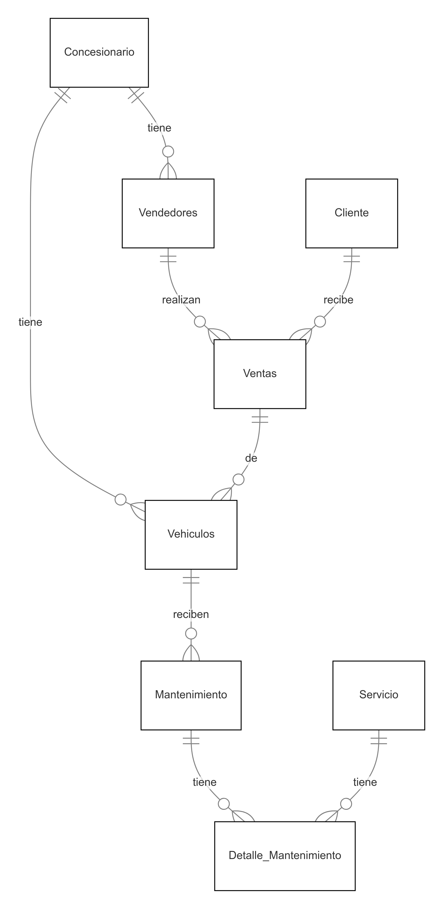

*Decisiones de Diseño.*

Modelo Relacional: Se optó por un modelo relacional, ya que la base de datos contiene diferentes entidades que tienen relaciones bien definidas (como ventas, clientes y vehículos).

Normalización: Las tablas están normalizadas para evitar la redundancia de datos y asegurar la consistencia. Cada entidad tiene su propia tabla, y las relaciones entre ellas están establecidas a través de claves foráneas.

Integridad de Datos: Se implementaron restricciones de integridad referencial y de unicidad para garantizar que los datos sean válidos y consistentes.

